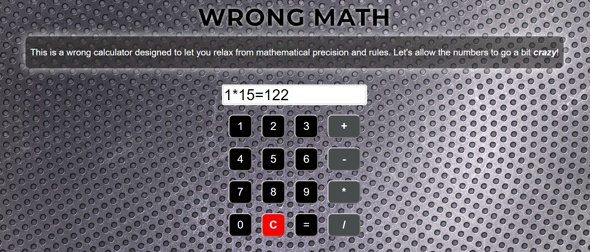

## Wrong Math
Wrong Math is a playful and creative tool designed to challenge the conventional rules of mathematics. In a world where every multiplication by zero equals zero, and 2+2 almost always gets us to 4, this tool allows the numbers to go a little crazy and give unexpected results.

## Features
Live Calculation Input: Enter your mathematical expressions and see them evaluated instantly, with a twist.
Falsified Results: Enjoy the unpredictability as the results are intentionally altered to surprise you.
Intuitive Interface: Simple and user-friendly interface to perform your quirky calculations.

## Screenshots


## Installation
Clone the repository:

1. Clone the repository:
    ```sh
    git clone https://github.com/Piotray/Wrong-Math.git
    cd webticker
    ```

2. Install the dependencies:
    ```sh
    npm install
    ```

3. Start the development server:
    ```sh
    npm run dev
    ```
## Usage
Open your web browser and navigate to http://localhost:3000.
Type your desired mathematical expression in the input field.
Experience the fun as the calculator provides you with unexpected results.

## Acknowledgements
Thanks to React for providing a powerful framework for building user interfaces. Inspired by the need to break free from the rigidity of traditional math.
